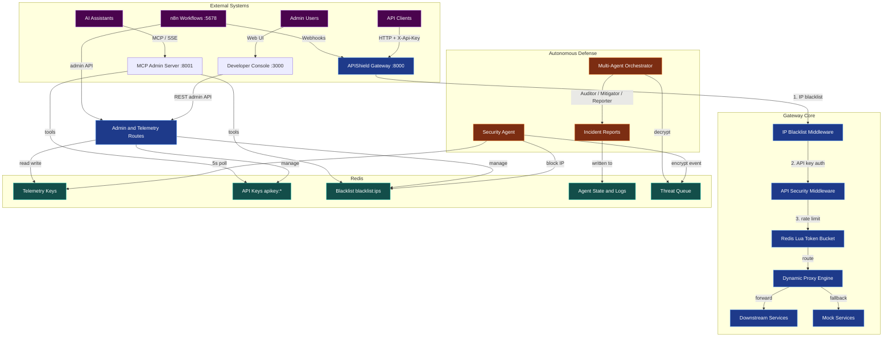
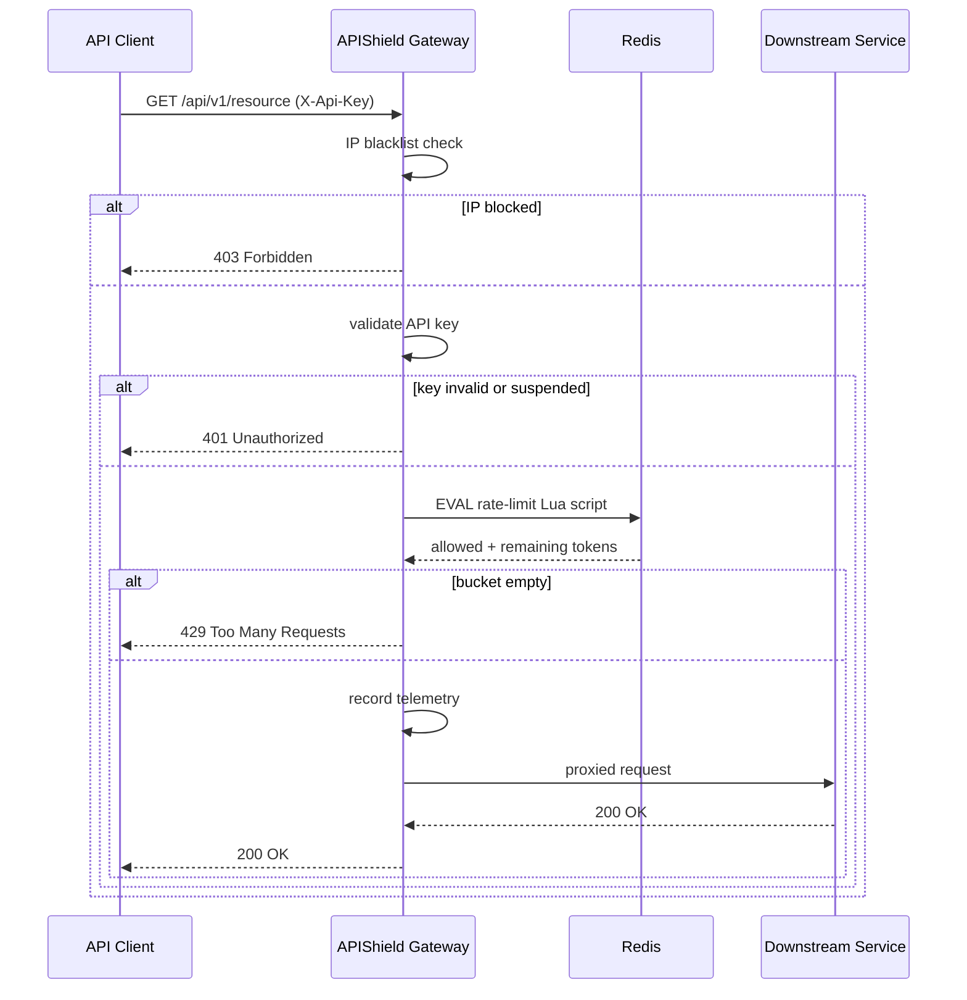
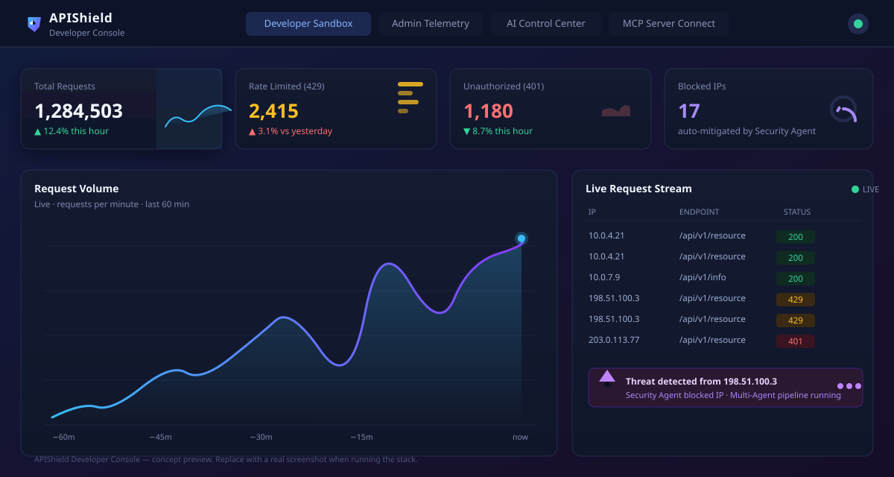

<p align="center">
  
</p>

<h1 align="center">🛡️ APIShield</h1>

<p align="center">
  <b>Smart API Gateway · Redis-powered Rate Limiter · Autonomous Threat Defense · Telemetry Console</b>
</p>

<p align="center">
  A zero-trust API Gateway that rate-limits with atomic Redis Lua scripts, detects and
  blocks abusive clients in real time through a self-healing Security Agent, and exposes
  the whole control plane to humans (React console), machines (REST admin API), and AI
  assistants (MCP server) — with n8n automation on top.
</p>

<p align="center">
  <a href="#getting-started"></a>
  <a href="#system-architecture"></a>
  <a href="#demo"></a>
</p>

<p align="center">
  <a href="https://nodejs.org/"></a>
  <a href="https://redis.io/"></a>
  <a href="https://react.dev/"></a>
  <a href="https://www.docker.com/"></a>
  <a href="https://kubernetes.io/"></a>
  <a href="https://n8n.io/"></a>
  <a href="https://modelcontextprotocol.io/"></a>
  <a href="https://github.com/mithilgala-cmd/smart-gateway-mcp/actions"></a>
  <a href="LICENSE"></a>
</p>

---

## Table of Contents

- [Why APIShield](#-why-apishield)
- [Features](#-features)
- [System Architecture](#-system-architecture)
- [Demo](#-demo)
- [Tech Stack](#-tech-stack)
- [Repository Structure](#-repository-structure)
- [Getting Started](#getting-started)
- [Environment Variables](#-environment-variables)
- [Core Concepts](#-core-concepts)
- [Security](#-security)
- [Developer Workflow](#-developer-workflow)
- [Roadmap](#-roadmap)
- [License](#-license)

---

## 🔒 Why APIShield

Every public API faces the same four threats, and most gateways answer only one
of them:

| Threat | Typical answer | APIShield's answer |
|--------|----------------|--------------------|
| **Credential stuffing / brute force** | Log it, review later | **Autonomous IP blocking** — the Security Agent detects the pattern in seconds and blocks the IP *before* the next request. |
| **Rate abuse / DDoS** | A fixed-per-IP limit | **Atomic token buckets per API key** — fair, sliding, sub-millisecond, enforced entirely inside Redis. |
| **Compromised API keys** | Manual suspension | **Auto-suspension** — the Multi-Agent Orchestrator sweeps for keys used in an attack and deactivates them. |
| **Operational blind spot** | A second dashboard to cross-check | **One telemetry source** — every request is recorded to Redis once; the console, MCP server, and n8n all read the same truth. |

APIShield is designed as a **showcase of production engineering**: a stateless,
horizontally-scalable gateway; an event-driven defense pipeline with encrypted
hand-off between processes; a control plane exposed three different ways (HTTP,
MCP, workflow automation); and deployment targets from a laptop demo to a
default-deny Kubernetes cluster.

---

## ✨ Features

**🛡️ Intelligent threat protection**
- Redis Lua token-bucket rate limiting — atomic, race-free, one round-trip, per-key buckets.
- Self-healing firewall — the Security Agent polls telemetry, detects abuse, and blocks IPs in real time.
- Multi-Agent Orchestrator — a specialized **Auditor → Mitigator → Reporter** pipeline writes markdown incident reports.
- Hybrid **AES-256-GCM + RSA-OAEP** encryption for threat events in transit.

**📊 Deep observability**
- Live request counters, per-endpoint metrics, and a recent-request stream.
- Redis keyspace inspector, API-key management, and blacklist management from the console.
- Auto-generated incident reports for every security event.

**🤖 AI-native operations**
- An **MCP Server** with 8 typed tools so AI assistants can operate the gateway safely.
- A natural-language copilot (`POST /admin/chat`) with an offline NLP fallback.
- A visual pipeline tracker that shows the agents working through a threat.

**⚙️ Enterprise operations**
- Docker Compose stack, hardened Kubernetes manifests (HPA, PDB, NetworkPolicies, ingress, TLS), and a CI pipeline.
- Stateless gateway that scales horizontally; mock downstream services for demos and `PROXY_ROUTES` for real ones.

---

## 🏗️ System Architecture



**The loop in three sentences:** every request enters through one chokepoint (the
gateway's three-stage middleware chain), and every outcome is recorded to Redis.
A Security Agent watches that telemetry and, when it sees abuse, blocks the IP
immediately and pushes an *encrypted* threat event to a queue. A Multi-Agent
Orchestrator consumes the queue and runs the Auditor → Mitigator → Reporter
workflow — suspending compromised keys and writing a markdown incident report —
while the console, MCP server, and n8n all operate the same control plane.

**Request lifecycle**



> 📖 A full walkthrough of every component — the Lua rate limiter, the
> encryption hand-off, the MCP server, and the deployment topologies — lives in
> [docs/ARCHITECTURE.md](docs/ARCHITECTURE.md).

---

## 🖥️ Demo

The Developer Console is a React dashboard with four tabs: **Developer Sandbox**
(simulate steady, DDoS, and auth-attack traffic), **Admin Telemetry** (live
metrics + Redis inspector), **AI Control Center** (copilot + multi-agent
visualiser), and **MCP Server Connect** (copy-paste MCP configs).



*Concept preview of the Developer Console. Run the stack locally (below) to see
the live dashboard — the four cards, request chart, live stream, and threat
alert are all driven by the gateway's real Redis telemetry.*

---

## 🧰 Tech Stack

| Layer | Technology | Used for |
|-------|------------|----------|
| **Gateway** | Node.js 20 · Express | The API gateway, admin API, agent daemons. |
| **Rate limiting** | Redis 7 · Lua scripting | Atomic token buckets per API key. |
| **Console** | React 19 · Vite 8 | Developer dashboard (dark enterprise theme). |
| **AI** | Model Context Protocol SDK · Google Gemini (optional) | Typed admin tools for AI assistants; natural-language copilot. |
| **Automation** | n8n · PostgreSQL 16 | Developer onboarding + abuse-prevention workflows. |
| **Deployment** | Docker Compose · Kubernetes | Local stack and production manifests (HPA, PDB, NetworkPolicy, ingress). |
| **CI** | GitHub Actions | Unit tests (gateway + MCP server), frontend lint + build. |
| **Testing** | Node's built-in test runner · supertest | Unit tests with mocked Redis. |

---

## 📁 Repository Structure

```
smart-gateway-mcp/
├── gateway/            # Express API gateway + Security Agent + Multi-Agent Orchestrator
│   ├── server.js       # Gateway, middleware chain, admin API, Lua rate limiter
│   ├── security-agent.js
│   ├── multi-agent-orchestrator.js
│   ├── encryption-util.js   # Hybrid AES-256-GCM + RSA-OAEP envelope
│   └── tests/
├── mcp-server/         # Model Context Protocol server (stdio + SSE), 8 tools
├── frontend/           # React 19 + Vite Developer Console
├── n8n/                # n8n workflow exports (onboarding + abuse-prevention cron)
├── k8s/                # Production Kubernetes manifests (14 YAML + secrets generator)
├── docs/               # Architecture, API reference, deployment, troubleshooting
├── .github/workflows/  # CI pipeline
└── docker-compose.yml  # Full local stack
```

Each component has its own README with setup, configuration, and internals:
[gateway](gateway/README.md) · [mcp-server](mcp-server/README.md) ·
[frontend](frontend/README.md) · [n8n](n8n/README.md) · [k8s](k8s/README.md)

---

## Getting Started

### Prerequisites

| Tool | Version | Notes |
|------|---------|-------|
| Docker + Docker Compose | 20.10+ / 2.x | Fastest path — runs the whole stack. |
| Node.js | 20+ | For local (non-container) development. |
| Redis | 7+ | Only for local dev without Docker. |

### Option A — Docker Compose (recommended for a first run)

```bash
# Clone & go
git clone https://github.com/mithilgala-cmd/smart-gateway-mcp.git
cd smart-gateway-mcp

# Build and start all six services
docker compose up --build -d
```

That's it. The full stack is now running:

| Service | Address | Purpose |
|---------|---------|---------|
| **Developer Console** | [http://localhost:3000](http://localhost:3000) | React dashboard. |
| **API Gateway** | [http://localhost:8000](http://localhost:8000) | Protected API + admin API. |
| **MCP Admin Server** | [http://localhost:8001/sse](http://localhost:8001/sse) | SSE transport for AI assistants. |
| **n8n** | [http://localhost:5678](http://localhost:5678) | Workflow automation. |
| **Redis** | `localhost:6379` | Rate-limit + telemetry + queue state. |
| **PostgreSQL** | `localhost:5432` | n8n's relational store. |

### Option B — Local development (no containers)

```bash
# 1. Redis must be running somewhere
docker run --name apishield-redis -p 6379:6379 -d redis:7-alpine

# 2. Install dependencies
npm install
npm --prefix gateway install
npm --prefix mcp-server install
npm --prefix frontend install

# 3. Configure env
cp gateway/.env.example gateway/.env
cp mcp-server/.env.example mcp-server/.env

# 4. Start everything (gateway + both agents + MCP + frontend)
npm run dev:all
```

> 💡 `npm run dev:all` uses [concurrently](https://www.npmjs.com/package/concurrently)
> to run the gateway, the Security Agent, the Multi-Agent Orchestrator, the MCP
> server, and the frontend together. Individual services can be started with
> `npm run gateway`, `npm run agent`, `npm run multi-agent`, `npm run mcp`,
> and `npm run frontend`.

### Smoke test

```bash
# Gateway health
curl http://localhost:8000/

# Call the protected mock API with the demo key
curl -H "X-Api-Key: demo-key-123" http://localhost:8000/api/v1/resource

# Watch live metrics
curl http://localhost:8000/admin/metrics
```

### Trigger an autonomous threat response (30-second demo)

> Requires the Security Agent and Multi-Agent Orchestrator daemons to be
> running (they are under `npm run dev:all`; start them individually with
> `npm run agent` and `npm run multi-agent`).

The demo key allows 60 requests/minute, so a burst of 80 requests burns through
the bucket and produces the `429`s the Security Agent looks for:

```bash
# 1. Simulate an auth-attack: hammer the gateway from one IP
for i in $(seq 1 80); do
  curl -s -H "X-Api-Key: demo-key-123" http://localhost:8000/api/v1/resource > /dev/null
done

# 2. The Security Agent notices 5+ 429s in a 15s window...
sleep 15

# 3. ...and the IP is blocked, an encrypted threat event is queued,
#    and the Orchestrator writes an incident report:
curl http://localhost:8000/admin/agent/logs
```

Watch it all happen live in the **AI Control Center** tab of the console.

### Import the n8n workflows

1. Open [http://localhost:5678](http://localhost:5678).
2. **Import workflow** → `n8n/workflows/developer_onboarding.json` and
   `n8n/workflows/abuse_prevention_cron.json`.
3. Activate both, then try onboarding:
   ```bash
   curl -X POST http://localhost:5678/webhook/developer-onboarding \
     -H "Content-Type: application/json" \
     -d '{"developer":"Ada Lovelace"}'
   ```
   The response contains a fresh API key for `Ada Lovelace`.

---

## ⚙️ Environment Variables

| Variable | Default | Component | Purpose |
|----------|---------|-----------|---------|
| `PORT` | `8000` | Gateway | Gateway HTTP port. |
| `REDIS_URL` | `redis://localhost:6379` | Gateway / MCP | Redis connection string (use `rediss://` for TLS). |
| `GEMINI_API_KEY` | — | Gateway | Enables the AI copilot; offline NLP fallback when unset. |
| `PROXY_ROUTES` | — | Gateway | JSON map of path → target URL for live proxying. |
| `ENCRYPTION_RSA_PRIVATE_KEY` | auto-generated | Gateway daemons | RSA private key for threat-event decryption. |
| `ENCRYPTION_RSA_PUBLIC_KEY` | auto-generated | Gateway daemons | RSA public key for threat-event encryption. |
| `PORT` | `8001` | MCP Server | MCP SSE port. |
| `TRANSPORT` | `stdio` | MCP Server | `stdio` or `sse`. |

> 🔑 Set the two `ENCRYPTION_RSA_*` variables **identically** on the Security
> Agent and the Multi-Agent Orchestrator — they share a queue of encrypted
> events, so a mismatched pair silently breaks cross-process decryption. The
> Kubernetes manifests mount one shared pair from a Secret for exactly this
> reason ([k8s/README.md](k8s/README.md#-secrets)).

---

## 🎯 Core Concepts

### The API Gateway

The gateway is a single Express application that is both the **front door** for
API traffic and the **control plane** for the whole system. Three middleware
functions wrap every protected route:

1. **IP blacklist** — checks `blacklist:ips`, returns `403` if the client is blocked.
2. **API-key auth** — requires `X-Api-Key`, validates it against `apikey:*`.
3. **Rate limiting** — runs the Redis Lua token bucket, returns `429` when exhausted.

Allowed requests are proxied to a configured downstream target
(`PROXY_ROUTES`) or answered by the bundled mock handlers. The admin routes
(`/admin/*`) expose metrics, key management, blacklist management, agent
configuration, and the AI copilot — consumed by the console, n8n, and the MCP
server alike. Full endpoint contracts: [docs/API_REFERENCE.md](docs/API_REFERENCE.md).

### Redis & the Lua rate limiter

Redis is the single source of truth for state. The rate limiter is a Lua script
executed atomically inside Redis (`EVAL`), so concurrent requests can never race
on the same bucket:

- **Atomic** — the bucket is read, refilled, and decremented in one Redis call.
- **Sliding** — tokens refill continuously by elapsed milliseconds.
- **Per-key** — each API key gets its own `rate:limit:<key>` bucket.
- **Self-cleaning** — idle buckets expire after 24 h.

Every request also writes telemetry (`telemetry:*`) that the console, MCP
server, and n8n read. See [docs/ARCHITECTURE.md §5–6](docs/ARCHITECTURE.md#5-atomic-rate-limiting-redis-lua).

### The MCP Server

The [Model Context Protocol](https://modelcontextprotocol.io/) server exposes
gateway administration as eight typed, AI-callable tools — `get_gateway_metrics`,
`get_blacklist`, `block_ip`, `unblock_ip`, `get_api_keys`, `update_key_quota`,
`update_key_status`, `get_agent_logs`. It speaks stdio (local AI tools) and SSE
(remote), and talks to Redis directly, so an assistant needs access to the
process rather than a long-lived admin token.

Connect Claude Desktop with:

```json
{
  "mcpServers": {
    "apishield": {
      "command": "node",
      "args": ["/absolute/path/to/mcp-server/index.js"]
    }
  }
}
```

Full contracts and Cursor/VS Code examples: [mcp-server/README.md](mcp-server/README.md).

### n8n automation

n8n handles the asynchronous, non-critical work — **developer onboarding**
(webhook → generate key → provision via the gateway → return it) and an
**abuse-prevention cron** (metrics → analyze → blacklist). Both call the same
admin API as everything else. Workflows ship ready to import in
[n8n/workflows/](n8n/workflows/) — see [n8n/README.md](n8n/README.md).

---

## 🔐 Security

**Defense in depth** — from the network inward:

1. **Network** — default-deny Kubernetes NetworkPolicies; `/admin/*` behind
   ingress basic-auth in production.
2. **Transport** — TLS at the ingress / reverse proxy.
3. **Application** — IP blacklist → API-key auth → atomic rate limiting → instant
   autonomous blocking.
4. **Data** — Redis `requirepass` + AOF; **hybrid-encrypted** threat events
   (AES-256-GCM payload wrapped with RSA-OAEP); secrets as Kubernetes Secrets.
5. **Supply chain** — non-root container users (UID 1000), pinned Node 20 bases,
   `npm ci` + lockfiles in CI.

**Responsible disclosure:** do **not** open public issues for vulnerabilities —
report privately via the process in [SECURITY.md](SECURITY.md). Known
by-design caveats (e.g. unauthenticated `/admin/*`) are documented there and in
the [k8s README](k8s/README.md).

---

## 🧑‍💻 Developer Workflow

```bash
npm test                        # gateway + MCP server unit tests (Redis mocked)
npm --prefix frontend run lint  # ESLint
npm --prefix frontend run build # production bundle
```

- **CI** — [`.github/workflows/ci.yml`](.github/workflows/ci.yml) runs the test
  suite and the frontend checks on every push/PR to `main`.
- **Kubernetes** — production manifests in [k8s/](k8s/) (see
  [k8s/README.md](k8s/README.md)); full walkthrough in
  [docs/DEPLOYMENT.md](docs/DEPLOYMENT.md).
- **Documentation** — every endpoint is documented in
  [docs/API_REFERENCE.md](docs/API_REFERENCE.md); common failures in
  [docs/TROUBLESHOOTING.md](docs/TROUBLESHOOTING.md).
- **Contributing** — please read [CONTRIBUTING.md](CONTRIBUTING.md) first, and
  follow the [Code of Conduct](CODE_OF_CONDUCT.md).

### Documentation

| Guide | Covers |
|-------|--------|
| [Architecture](docs/ARCHITECTURE.md) | Component roles, request path, Lua limiter, threat pipeline, encryption. |
| [API Reference](docs/API_REFERENCE.md) | Every gateway endpoint + MCP tool contract. |
| [Deployment](docs/DEPLOYMENT.md) | Local, Docker Compose, Kubernetes, CI, hardening checklist. |
| [Troubleshooting](docs/TROUBLESHOOTING.md) | Common failure modes across all targets. |

---

## 🗺️ Roadmap

**Ideas we're excited about** (PRs welcome):

- **Leaky-bucket / sliding-window strategies** as pluggable rate-limiters alongside the token bucket.
- **WebSocket + server-sent live updates** for the console's telemetry panels.
- **Prometheus exporter** for the Redis telemetry keys, with pre-built Grafana dashboards.
- **Multi-datacenter Redis** (Redis Cluster) support and read-your-writes consistency notes.
- **More MCP tools** — key rotation, config export/import, and workflow health.
- **OpenAPI spec generation** for the gateway + admin API.
- **GitHub Actions for e2e** — spin up the compose stack, run the threat-response demo, assert the reports.

---

## 📜 License

Distributed under the **MIT License**. See [LICENSE](LICENSE) for details.

---

## 🙏 Acknowledgements

- [Model Context Protocol](https://modelcontextprotocol.io/) for standardizing AI↔tool interfaces.
- [Redis](https://redis.io/) and its Lua scripting model — the backbone of the rate limiter.
- [Express](https://expressjs.com/), [React](https://react.dev/), [Vite](https://vite.dev/), and [n8n](https://n8n.io/).
- The open-source security community that keeps raising the bar for gateway design.

---

<p align="center">
  <sub>Built with ❤️ · <i>APIShield — protecting APIs with intelligence, not just barriers.</i></sub>
</p>
