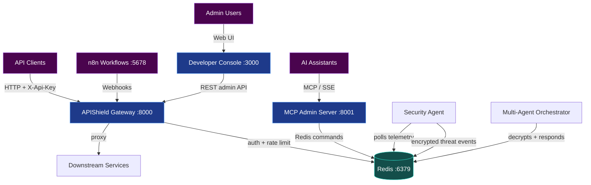
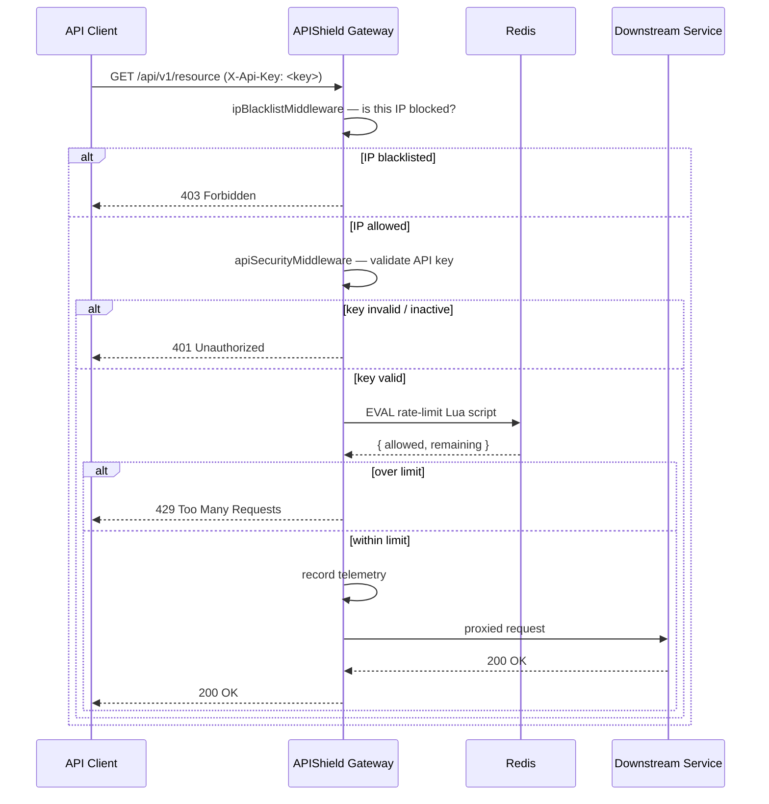
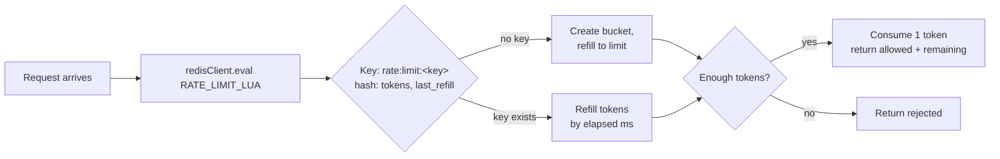
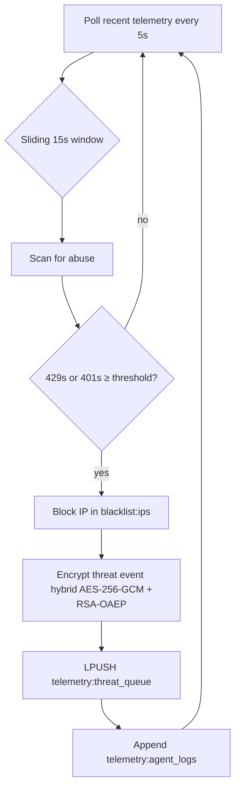
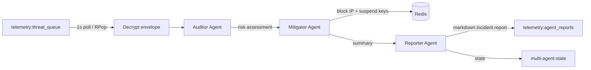
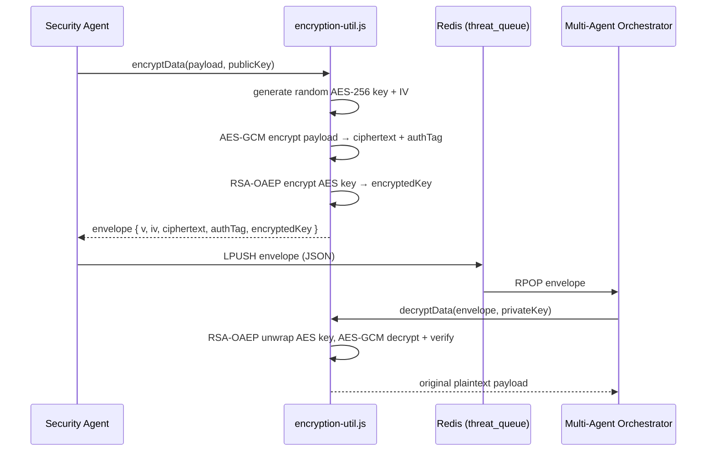

# 🏗️ APIShield — Architecture

This document explains *why* APIShield is built the way it is and *how* every
component interacts. It is the companion to the [root README](../README.md) and
assumes you already have a high-level picture from the [quick start](../README.md#getting-started).

---

## 1. Design Goals

APIShield exists to answer one question: *how do you protect a modern API
ecosystem without putting a human in the critical path?*

The architecture optimises for five properties:

| Goal | How the system delivers it |
|------|----------------------------|
| **Zero-trust gatekeeping** | Every proxied request passes through *exactly one* choke point: IP blacklist → API-key auth → rate limiting. No request reaches a downstream service without all three checks. |
| **Sub-millisecond overhead** | Rate limiting is a single atomic Redis `EVAL` (Lua script) round-trip. Bucket state lives and mutates inside Redis, so there is no read-then-write race and no distributed lock. |
| **Autonomous response** | A Security Agent watches telemetry, blocks offending IPs instantly, and pushes *encrypted* threat events to a queue. A Multi-Agent Orchestrator consumes that queue and runs an Auditor → Mitigator → Reporter workflow. No human needed. |
| **Observability by default** | Every request is written to Redis telemetry keys. The Developer Console, the MCP server, and n8n all read the *same* live data source — there is no separate telemetry pipeline to keep in sync. |
| **Operational flexibility** | The gateway proxies real downstream services or falls back to built-in mocks, so it works as a demo on a laptop and as a real ingress in Kubernetes without code changes. |

---

## 2. System Overview

```
                            ┌──────────────────────────────────────────────┐
                            │                 APIShield                     │
   API Clients ─────────────►│   ┌────────────┐        ┌────────────────┐  │
   Admin Users ─────────────►│   │   Gateway  │◄──────►│ MCP Admin Svr  │  │
   AI Assistants ───────────►│   │  (:8000)   │        │    (:8001)     │  │
   n8n Workflows ──────────► │   └─────┬──────┘        └────────────────┘  │
                            │         │                                     │
                            │         ▼                                     │
                            │   ┌────────────┐                             │
                            │   │   Redis    │◄────────────┐               │
                            │   │  (:6379)   │             │               │
                            │   └────────────┘          ┌────────────────┐ │
                            │                           │  n8n (:5678)    │ │
                            │   ┌────────────┐          └────────────────┘ │
                            │   │ Developer  │                             │
                            │   │ Console    │                             │
                            │   │  (:3000)   │                             │
                            │   └────────────┘                             │
                            └──────────────────────────────────────────────┘
```

The following Mermaid diagram shows the same topology as a graph. It is the
"50,000-foot view" — every subsequent section zooms into one region.



> **Naming note:** throughout this project, *"the gateway"* refers to the Node.js
> service in [`gateway/`](../gateway/) (also called `apishield-gateway` in Docker /
> Kubernetes), *not* to the physical network device. The gateway is a software
> chokepoint, not an appliance.

---

## 3. Component Roles

| Component | Directory | Role |
|-----------|-----------|------|
| **APIShield Gateway** | [`gateway/server.js`](../gateway/server.js) | Express application that enforces the security middleware chain, proxies downstream services, records telemetry, and exposes the admin API. |
| **Security Agent** | [`gateway/security-agent.js`](../gateway/security-agent.js) | Background daemon that polls telemetry every 5 s, detects abusive IPs, blocks them instantly, and encrypts threat events onto a Redis queue. |
| **Multi-Agent Orchestrator** | [`gateway/multi-agent-orchestrator.js`](../gateway/multi-agent-orchestrator.js) | Background daemon that consumes the threat queue and runs the Auditor → Mitigator → Reporter response pipeline. |
| **Encryption utility** | [`gateway/encryption-util.js`](../gateway/encryption-util.js) | Hybrid AES-256-GCM + RSA-OAEP envelope used to protect threat events in transit between the agent and the orchestrator. |
| **MCP Admin Server** | [`mcp-server/index.js`](../mcp-server/index.js) | Model Context Protocol server exposing 8 gateway-admin tools over stdio or SSE so AI assistants can operate the gateway safely. |
| **Developer Console** | [`frontend/`](../frontend/) | React + Vite dashboard: Developer Sandbox, Admin Telemetry, AI Control Center, and MCP Server Connect tabs. |
| **n8n Workflows** | [`n8n/workflows/`](../n8n/workflows/) | Low-code automation for developer onboarding and abuse-prevention cron jobs. |

---

## 4. The Gateway Request Path

Every inbound request to a *protected* route flows through the same middleware
chain in [`gateway/server.js`](../gateway/server.js):



The three stages in detail:

1. **IP blacklist** — `ipBlacklistMiddleware` checks the client IP against the
   `blacklist:ips` Redis set. Blacklisted IPs receive `403 Forbidden` with a
   small "blocked" telemetry record. This is the cheapest check and runs first.
2. **API-key auth** — `apiSecurityMiddleware` requires an `X-Api-Key` header,
   looks up `apikey:<key>` in Redis, and rejects missing, unknown, or suspended
   keys with `401 Unauthorized`.
3. **Rate limiting** — the same middleware runs the Lua token bucket (see
   [§5](#5-atomic-rate-limiting-redis-lua)). A rejected request gets `429 Too
   Many Requests`.

### 4.1 Protected vs. unprotected routes

| Route | Middleware | Notes |
|-------|-----------|-------|
| `/api/v1/resource`, `/api/v1/info` | blacklist + auth + rate limit | Mock downstream services behind the full chain. |
| `/api/v1/*` configured via `PROXY_ROUTES` | blacklist + auth + rate limit | Real downstream proxy targets. |
| `/downstream/resource`, `/downstream/info` | none | Direct mock handlers — used to demonstrate downstream behaviour without auth. **Do not expose in production.** |
| `/admin/*` | none | Admin + telemetry API for the console / MCP / n8n. In Kubernetes these are protected at the ingress layer (see [`../k8s/README.md`](../k8s/README.md)). |

> ⚠️ The `/admin/*` and `/downstream/*` routes carry **no application-level auth**
> by design: they are the control plane. In any real deployment they must sit
> behind network-level protection (ingress basic-auth, mTLS, or a VPN). The
> Kubernetes manifests ship with commented basic-auth annotations for exactly
> this reason.

---

## 5. Atomic Rate Limiting (Redis Lua)

The heart of the gateway is `RATE_LIMIT_LUA` in
[`gateway/server.js`](../gateway/server.js). Instead of reading a counter,
decrementing it in Node, and writing it back (a classic time-of-check /
time-of-use race), the *entire* decision runs inside Redis:



Properties that matter in production:

- **Atomicity** — the script evaluates and mutates bucket state in a single
  Redis call. Concurrent requests can never both observe the same "last token".
- **Single round-trip** — one `EVAL` returns both the decision and the remaining
  count, so the added latency is one Redis hop (sub-millisecond on localhost).
- **Sliding refill** — tokens refill continuously based on elapsed milliseconds,
  not in coarse one-minute chunks, which smooths legitimate bursts.
- **Self-cleaning** — buckets expire after 24 h of inactivity, so abandoned keys
  never leak memory.
- **Per-key isolation** — the bucket key embeds the API key
  (`rate:limit:<apiKey>`), so one noisy consumer cannot starve another.

---

## 6. Telemetry Model

All observability is **read from Redis, written by the gateway** — there is no
separate metrics agent. The keys the gateway maintains:

| Redis key | Type | Content |
|-----------|------|---------|
| `telemetry:total_requests` | string (counter) | Running total of requests that reached the gateway. |
| `telemetry:rate_limited_requests` | string (counter) | Requests rejected with `429`. |
| `telemetry:unauthorized_requests` | string (counter) | Requests rejected with `401`. |
| `telemetry:recent_requests` | list | Last ~50 request records (IP, path, status, key name, timestamp). |
| `telemetry:endpoint:<path>` | string (counter) | Per-endpoint hit counter. |
| `telemetry:agent_logs` | list | Security Agent lifecycle log lines. |
| `telemetry:agent_reports` | list | Markdown incident reports from the Reporter agent. |
| `telemetry:threat_queue` | list | **Encrypted** threat events produced by the Security Agent. |
| `blacklist:ips` | set | Blocked IP addresses. |
| `apikey:<key>` | hash | Key metadata: `name`, `limit`, `active`, `createdAt`. |
| `rate:limit:<key>` | hash | Live token-bucket state (managed by the Lua script). |
| `config:security_agent_active` | string | `"true"`/`"false"` master switch for the Security Agent. |
| `config:max_429_violations` | string | Abuse threshold for `429` responses (default `5`). |
| `config:max_401_violations` | string | Abuse threshold for `401` responses (default `5`). |
| `multi-agent:state` | string (JSON) | Orchestrator pipeline state (`activeNode`, `currentThreat`), TTL 60 s. |

The gateway never assumes a fixed schema for these keys — every reader (console,
MCP server, n8n, the agents) treats Redis as the single source of truth, which
keeps the components decoupled.

---

## 7. Autonomous Threat Response

Two daemons turn telemetry into action. They ship inside the gateway image
(`apishield-gateway`) and are started with a command override in Kubernetes, or
directly with `node` for local development (`npm run agent` /
`npm run multi-agent`).

### 7.1 The Security Agent — `gateway/security-agent.js`



Key behaviours:

- Polls recent telemetry every **5 s** and evaluates a **sliding 15 s window**,
  so a burst that "fades out" is not acted on twice.
- Violation thresholds are configurable at runtime via `POST /admin/agent/config`
  (defaults: 5× `429` or 5× `401` within the window).
- The **block is immediate and local**: the IP is added to `blacklist:ips`
  before anything else happens, so the next request is rejected even if the
  queue is slow.
- The **event is encrypted before it touches the queue** (see §8), so an
  attacker who compromises Redis cannot read threat details.

### 7.2 The Multi-Agent Orchestrator — `gateway/multi-agent-orchestrator.js`



- Pops one encrypted event at a time (backoff on empty queue), decrypts with the
  shared RSA private key, and runs three specialised stages:
  1. **Auditor** — classifies the event and scores the threat.
  2. **Mitigator** — executes the response: blocks the offending IP and sweeps
     for compromised API keys (suspending any that were used in the attack).
  3. **Reporter** — writes a human-readable markdown incident report to
     `telemetry:agent_reports`.
- Pipeline progress is persisted to `multi-agent:state` (TTL 60 s) so the
  Developer Console can render a live visualiser.
- The daemon survives Redis outages with **exponential backoff** and reconnects
  automatically.

---

## 8. Encrypted Threat Events (Hybrid AES-RSA)

Threat events cross a *trust boundary*: the Security Agent writes to a shared
Redis queue, and the Multi-Agent Orchestrator (a different process) reads it. To
ensure that nothing on the wire or in Redis can read the event payload, the two
daemons share an **RSA key pair** and use it to wrap a per-event **AES-256-GCM**
data key — the standard hybrid cryptosystem:



Why this shape:

- **AES-256-GCM** is fast and provides authenticated encryption (tamper
  detection) for the payload itself.
- **RSA-OAEP (SHA-256)** protects the AES key, so a per-event key never travels
  in the clear and only the holder of the private key can decrypt.
- The **envelope format** `{ v, iv, ciphertext, authTag, encryptedKey }` is
  self-describing and versioned, so the format can evolve without breaking the
  reader.
- Keys are provided via `ENCRYPTION_RSA_PRIVATE_KEY` / `ENCRYPTION_RSA_PUBLIC_KEY`.
  When they are unset (local dev), the utility **auto-generates a throwaway
  pair** so the pipeline still runs — but because the pair is ephemeral, the
  orchestrator can only decrypt events it generates itself. This is why the
  Kubernetes secrets ship a *shared, mounted* pair (see
  [`../k8s/README.md`](../k8s/README.md#-secrets)).

---

## 9. The MCP Admin Server

The [Model Context Protocol](https://modelcontextprotocol.io/) server
([`mcp-server/`](../mcp-server/)) exposes gateway administration as a set of
typed tools that AI assistants can discover and call:

| Tool | Effect |
|------|--------|
| `get_gateway_metrics` | Live request counters + recent request log. |
| `get_blacklist` | Current blocked IPs. |
| `block_ip` / `unblock_ip` | Add/remove an IP from the blacklist. |
| `get_api_keys` | All keys with quotas, status, creation dates. |
| `update_key_quota` | Change a key's requests-per-minute limit. |
| `update_key_status` | Activate/suspend a key. |
| `get_agent_logs` | Security Agent logs + Orchestrator incident reports + live pipeline state. |

It runs in two transport modes:

- **stdio** (default) — for local AI tools that spawn the process (Claude
  Desktop, Cursor, VS Code, etc.).
- **SSE** (`TRANSPORT=sse`) — for remote/HTTP access. The server exposes
  `GET /sse` for the event stream and `POST /messages` for client→server
  messages. This is the mode used in Docker Compose and Kubernetes.

Because the MCP server talks directly to Redis, an AI assistant can operate the
gateway **without needing an HTTP admin token** — the assistant needs access to
the process, not to a long-lived credential. See the full tool contracts in
[`API_REFERENCE.md`](./API_REFERENCE.md).

---

## 10. The Developer Console

The React console (`frontend/`) is the human interface to everything above. It
is deliberately **not** a read-only dashboard:

| Tab | What it does |
|-----|--------------|
| **Developer Sandbox** | Call the gateway with the sandbox API key, run scenario simulations (steady traffic / DDoS / auth-attack), and watch live request logs. |
| **Admin Telemetry** | Live metrics, Redis keyspace inspector, blacklist management, API-key management. |
| **AI Control Center** | Natural-language copilot (`POST /admin/chat`), one-click abuse scenarios, multi-agent pipeline visualiser, and generated incident reports. |
| **MCP Server Connect** | Point an MCP client at the server and get the exact Claude Desktop / Cursor config snippet. |

The console reads/writes the same Redis-backed admin API as the MCP server and
n8n, so any action taken from one surface is immediately visible in the others.
When the gateway is unreachable it falls back to a **simulated mode** so the UI
remains explorable during development.

---

## 11. n8n Automation

n8n handles the asynchronous, non-critical workflows that the gateway should
not block on. Two workflows ship in [`n8n/workflows/`](../n8n/workflows/):

- **Developer Onboarding** — a webhook that takes a developer's name, generates
  an API key, provisions it in the gateway via `POST /admin/keys`, and returns
  the key to the caller.
- **Abuse Prevention Cron** — every minute, pulls gateway metrics
  (`GET /admin/metrics`), analyses the recent request log for abusive IPs, and
  blacklists offenders via `POST /admin/blacklist`.

Both call the gateway over the Docker network (`http://gateway:8000`), so they
demonstrate the same admin API the console and MCP server use — one control
plane, three different clients.

---

## 12. Deployment Topologies

| Topology | Where | What runs |
|----------|-------|-----------|
| **Local dev** | Your machine | `npm run dev:all` (or per-service `npm run`), Redis via `docker run` or the compose file. |
| **Docker Compose** | [`../docker-compose.yml`](../docker-compose.yml) | All 6 services on a shared `apishield-net` bridge. |
| **Kubernetes** | [`../k8s/`](../k8s/) | Namespaced production manifests with HPA, PDB, network policies, ingress, secrets. |
| **CI** | [`.github/workflows/ci.yml`](../.github/workflows/ci.yml) | Unit tests for gateway + MCP server, lint + production build for the frontend. |

The **same image** (`apishield-gateway`) is used for the gateway and both agent
daemons; Kubernetes runs each daemon in its own container via a command
override, and local development runs them with `node`. This keeps the "brain"
(gateway code) and the "reflexes" (daemons) versioned together.

See [`DEPLOYMENT.md`](./DEPLOYMENT.md) for the full walkthrough.

---

## 13. Security Posture

Defence in depth, from the network inward:

1. **Network** — Kubernetes default-deny NetworkPolicies (see
   [`../k8s/README.md`](../k8s/README.md#-network-policies)); `/admin/*` behind
   ingress basic-auth in production.
2. **Transport** — TLS terminated at the ingress / reverse proxy.
3. **Application (this project)** — IP blacklist, API-key auth, atomic rate
   limiting, instant autonomous blocking.
4. **Data at rest & in transit** — Redis AOF persistence with `requirepass`
   (Kubernetes), hybrid-encrypted threat events, secrets managed as Kubernetes
   Secrets / environment variables.
5. **Supply chain** — non-root container users (UID 1000), pinned Node 20
   base images, `npm ci` + lockfiles in CI.

> 🔒 If you find a vulnerability, please follow the disclosure process in
> [`SECURITY.md`](../SECURITY.md).

---

## 14. Related Documentation

- [Root README — quick start & overview](../README.md)
- [API Reference — every endpoint and MCP tool](./API_REFERENCE.md)
- [Deployment Guide — local, Docker, Kubernetes, production hardening](./DEPLOYMENT.md)
- [Troubleshooting — common failure modes](./TROUBLESHOOTING.md)
- [Kubernetes manifests](../k8s/README.md)
- [Gateway component guide](../gateway/README.md)
- [MCP Server component guide](../mcp-server/README.md)
- [n8n workflows](../n8n/README.md)
