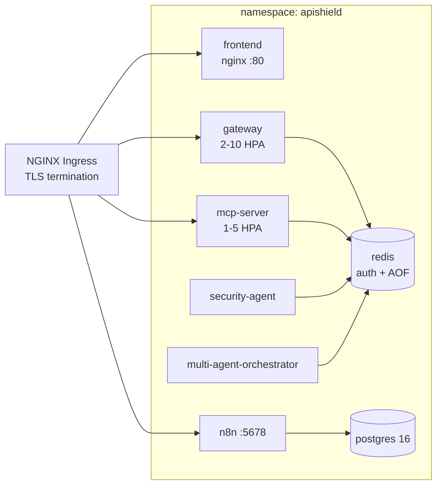

# 🚀 APIShield — Deployment Guide

Four supported deployment targets, from a laptop demo to a hardened cluster.
Choose the one that matches your environment; the underlying services are
identical in every case.

| Target | Read this | Best for |
|--------|-----------|----------|
| Local development | [§1 Local dev](#1-local-development) | Contributing, exploring the codebase |
| Docker Compose | [§2 Docker Compose](#2-docker-compose) | Full stack on one machine |
| Kubernetes | [§3 Kubernetes](#3-kubernetes) | Production-ish, horizontally scaled |
| CI / CD | [§4 CI pipeline](#4-ci-pipeline) | Automated quality gates |

Related: [Architecture](./ARCHITECTURE.md) · [API Reference](./API_REFERENCE.md) ·
[Troubleshooting](./TROUBLESHOOTING.md) · [root README](../README.md)

---

## 1. Local Development

### 1.1 Prerequisites

- **Node.js 20+**
- **Redis 7+** (or any `redis://` URL — the stack works with Upstash/Valkey too)
- [n8n](https://docs.n8n.io/hosting/installation/docker/) (optional, for the
  automation workflows)
- Docker (optional — only if you prefer containers for Redis)

### 1.2 Start Redis

```bash
docker run --name apishield-redis -p 6379:6379 -d redis:7-alpine
```

### 1.3 Install dependencies

```bash
npm install                       # root workspace (concurrently for dev:all)
npm --prefix gateway install
npm --prefix mcp-server install
npm --prefix frontend install
```

### 1.4 Run the whole stack at once

The root `package.json` provides a single command that runs the gateway, the
MCP server, both agent daemons, and the frontend concurrently:

```bash
npm run dev:all
```

Or run any subset individually:

```bash
npm run gateway       # APIShield Gateway  → http://localhost:8000
npm run mcp           # MCP Admin Server   → stdio (default)
npm run agent         # Security Agent daemon
npm run multi-agent   # Multi-Agent Orchestrator daemon
npm run frontend      # Developer Console  → http://localhost:3000
```

> 💡 The two daemons (`agent`, `multi-agent`) require the gateway to be running
> and Redis reachable. Start the gateway first.

### 1.5 Configure environment

Copy the example env files and adjust:

```bash
cp gateway/.env.example gateway/.env
cp mcp-server/.env.example mcp-server/.env
```

| Variable | File | Default | Purpose |
|----------|------|---------|---------|
| `PORT` | `gateway/.env` | `8000` | Gateway HTTP port. |
| `REDIS_URL` | `gateway/.env` | `redis://localhost:6379` | Redis connection string. |
| `GEMINI_API_KEY` | `gateway/.env` | — | Enables the AI copilot (falls back to offline NLP when unset). |
| `PROXY_ROUTES` | `gateway/.env` | — | JSON map of path → target URL for live proxying. |
| `PORT` | `mcp-server/.env` | `8001` | MCP SSE server port. |
| `TRANSPORT` | `mcp-server/.env` | `stdio` | `stdio` or `sse`. |
| `REDIS_URL` | `mcp-server/.env` | `redis://localhost:6379` | Redis connection string. |
| `ENCRYPTION_RSA_PRIVATE_KEY` / `ENCRYPTION_RSA_PUBLIC_KEY` | gateway env | auto-generated | RSA pair for the agent → orchestrator encryption. Set both for cross-process decrypt (see [Architecture §8](./ARCHITECTURE.md#8-encrypted-threat-events-hybrid-aes-rsa)). |

### 1.6 Run the tests

```bash
npm test                          # gateway + MCP server unit tests
npm --prefix gateway test
npm --prefix mcp-server test
npm --prefix frontend run lint && npm --prefix frontend run build
```

---

## 2. Docker Compose

The [compose file](../docker-compose.yml) brings up all six services on a shared
bridge network — this is the recommended way to see the *entire* product working
together (including n8n and SSE-mode MCP).

### 2.1 Start the stack

```bash
docker compose up --build -d
```

### 2.2 Service map

| Service | Container | Host port | Notes |
|---------|-----------|-----------|-------|
| `redis` | `apishield-redis` | `6379` | Rate-limit + telemetry + queue state. |
| `postgres` | `apishield-postgres` | `5432` | n8n's relational store. |
| `n8n` | `apishield-n8n` | `5678` | Workflow engine (auth disabled for local dev). |
| `gateway` | `apishield-gateway` | `8000` | The gateway itself (`server.js`). Run the agent daemons separately (see note below). |
| `mcp-server` | `apishield-mcp-server` | `8001` | Runs in `TRANSPORT=sse` mode. |
| `frontend` | `apishield-frontend` | `3000` | nginx-served React build. |

> **Where are the agent daemons?** The compose `gateway` service runs the
> gateway (`server.js`) only — the Security Agent and Multi-Agent Orchestrator
> are *separate processes*. Locally, run them with `npm run agent` and
> `npm run multi-agent` from the repo root (see [§1.4](#14-run-the-whole-stack-at-once)).
> In Kubernetes they run as their own containers via a command override on the
> same image — see [agents-deployment.yaml](../k8s/agents-deployment.yaml).

### 2.3 Verify

```bash
curl http://localhost:8000/                          # gateway identity
curl -H "X-Api-Key: demo-key-123" http://localhost:8000/api/v1/resource
docker compose ps
```

### 2.4 Useful commands

```bash
docker compose logs -f gateway        # follow gateway logs
docker compose down                   # stop (keep volumes)
docker compose down -v                # stop and delete volumes (fresh start)
```

### 2.5 Import the n8n workflows

1. Open `http://localhost:5678`.
2. **Import workflow** → select `n8n/workflows/developer_onboarding.json`
   and `n8n/workflows/abuse_prevention_cron.json`.
3. Activate both. They call the gateway at `http://gateway:8000` over the
   compose network, so they work out of the box.
4. Try onboarding: `POST http://localhost:5678/webhook/developer-onboarding`
   with a JSON body like `{ "developer": "Ada Lovelace" }`.

See the [n8n guide](../n8n/README.md) for workflow internals.

---

## 3. Kubernetes

The production-hardened manifests live in [`k8s/`](../k8s/). They include a
dedicated namespace, default-deny network policies, HPA, PDB, ingress, secrets,
and a Redis with `requirepass` + AOF. Full instructions — including TLS via
cert-manager and secret rotation — are in the
[k8s README](../k8s/README.md).

Quick-start summary:

```bash
kubectl apply -f k8s/namespace.yaml
kubectl apply -f k8s/secrets.example.yaml
kubectl apply -f k8s/configmap.yaml
kubectl apply -f k8s/postgres-deployment.yaml
kubectl apply -f k8s/redis-deployment.yaml
kubectl apply -f k8s/gateway-deployment.yaml
kubectl apply -f k8s/mcp-server-deployment.yaml
kubectl apply -f k8s/frontend-deployment.yaml
kubectl apply -f k8s/n8n-deployment.yaml
kubectl apply -f k8s/agents-deployment.yaml
kubectl apply -f k8s/hpa.yaml
kubectl apply -f k8s/pdb.yaml
kubectl apply -f k8s/network-policy.yaml
kubectl apply -f k8s/ingress.yaml
```

> ⚠️ **Always regenerate the demo secrets before production:**
> `./k8s/generate-secrets.sh` writes a fresh `k8s/secrets.yaml` (gitignored) with
> new credentials and a new RSA pair.

### 3.1 In-cluster topology at a glance



---

## 4. CI Pipeline

The [CI workflow](../.github/workflows/ci.yml) runs on every push/PR to `main`:

| Job | What it does |
|-----|--------------|
| `tests` (matrix: gateway, mcp-server) | `npm ci` + `npm test` on Node 20 (Node's built-in test runner). |
| `frontend` | `npm ci` → ESLint → production `vite build`. |

The pipeline is the project's quality gate: a PR must pass both jobs before it
merges. Locally, `npm test` at the root runs the same test suites.

---

## 5. Production Hardening Checklist

- [ ] **Secrets** — never the example values. `k8s/generate-secrets.sh`, real
      `GEMINI_API_KEY`, non-default admin credentials.
- [ ] **TLS everywhere** — ingress TLS, SSE `proxy-read-timeout`, n8n behind HTTPS.
- [ ] **Protect the control plane** — `/admin/*` and `/downstream/*` behind
      ingress basic-auth / mTLS / VPN (they carry no app-level auth by design).
- [ ] **Redis** — `requirepass` + AOF (Kubernetes manifests do this by default;
      enable for Docker: `docker run ... redis-server --requirepass ...`).
- [ ] **Network policies** — default-deny applied (k8s). Review the n8n internet
      egress rule and the gateway Gemini egress rule before enabling them.
- [ ] **Horizontal scaling** — gateway is stateless; scale with the HPA. The
      mock downstream handlers and in-memory state do not scale — put real
      downstream services behind `PROXY_ROUTES` and scale those independently.
- [ ] **Observability** — the gateway is the metrics source; export Redis
      telemetry keys to your monitoring (Prometheus export via `redis-cli` or a
      sidecar) and alert on `telemetry:rate_limited_requests` growth.
- [ ] **Backups** — Redis AOF and Postgres PVCs (Velero, RDS snapshots, etc.).

---

## 6. Related

- [Architecture](./ARCHITECTURE.md)
- [API Reference](./API_REFERENCE.md)
- [Troubleshooting](./TROUBLESHOOTING.md)
- [Kubernetes manifests](../k8s/README.md)
- [Root README](../README.md)
