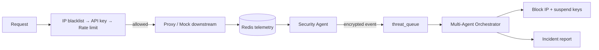

# 🛡️ APIShield Gateway

The core of APIShield: an Express-based **smart API gateway** that enforces a
zero-trust security chain, rate-limits with an atomic Redis token bucket, records
telemetry, proxies downstream services, and hosts the admin/control-plane API.

This directory also ships the two autonomous daemons that make APIShield
self-healing:

| File | Role |
|------|------|
| [`server.js`](server.js) | The gateway itself. |
| [`security-agent.js`](security-agent.js) | Background threat detector + instant IP blocker. |
| [`multi-agent-orchestrator.js`](multi-agent-orchestrator.js) | Auditor → Mitigator → Reporter response pipeline. |
| [`encryption-util.js`](encryption-util.js) | Hybrid AES-256-GCM + RSA-OAEP encryption for threat events. |
| [`tests/`](tests/) | Unit tests for `server.js` and `encryption-util.js`. |

---

## 📖 How it works

Every protected request flows through one middleware chain
(see [Architecture §4](../docs/ARCHITECTURE.md#4-the-gateway-request-path)):

1. **IP blacklist** — reject blocked IPs (`403`).
2. **API-key auth** — validate `X-Api-Key` against `apikey:*` in Redis (`401`).
3. **Rate limiting** — atomic Lua token bucket in Redis (`429` when exhausted).

On success the request is proxied to a real downstream target (`PROXY_ROUTES`)
or answered by the bundled mock handlers. Every request — allowed or rejected —
is written to Redis telemetry keys that the
[Developer Console](../frontend/), [MCP Server](../mcp-server/), and
[n8n workflows](../n8n/) all read.

The two daemons close the loop: the **Security Agent** polls telemetry every 5 s,
blocks abusive IPs instantly, and pushes *encrypted* threat events to
`telemetry:threat_queue`; the **Multi-Agent Orchestrator** consumes that queue
and executes the Auditor → Mitigator → Reporter workflow.



---

## 🚀 Getting started

```bash
# 1. Redis must be reachable
docker run --name apishield-redis -p 6379:6379 -d redis:7-alpine

# 2. Install + configure
npm install
cp .env.example .env      # then edit REDIS_URL / GEMINI_API_KEY as needed

# 3. Run the gateway
npm run dev               # nodemon (development)
npm start                 # plain node (production)
```

The gateway seeds a demo key on boot and listens on `http://localhost:8000`.
Verify:

```bash
curl http://localhost:8000/
curl -H "X-Api-Key: demo-key-123" http://localhost:8000/api/v1/resource
```

Run the agent daemons in separate terminals:

```bash
node security-agent.js
node multi-agent-orchestrator.js
```

> 💡 Prefer one command? From the repo root: `npm run dev:all` starts the gateway,
> both daemons, the MCP server, and the frontend together.

---

## ⚙️ Configuration

| Env var | Default | Purpose |
|---------|---------|---------|
| `PORT` | `8000` | HTTP port. |
| `REDIS_URL` | `redis://localhost:6379` | Redis connection string. |
| `GEMINI_API_KEY` | — | Enables the `/admin/chat` AI copilot (offline NLP fallback when unset). |
| `PROXY_ROUTES` | — | JSON map `{"/path": "https://target.example.com/api"}` for live proxying. |
| `ENCRYPTION_RSA_PRIVATE_KEY` | auto-generated | RSA private key (PEM) for decrypting threat events. |
| `ENCRYPTION_RSA_PUBLIC_KEY` | auto-generated | RSA public key (PEM) for encrypting threat events. |

> 🔑 **Why the RSA keys matter:** the Security Agent encrypts threat events
> before they touch Redis; the Orchestrator decrypts them. If each process
> auto-generates its own pair (the fallback), cross-process decryption fails.
> Set both keys identically on both daemons — or mount the shared pair that
> [Kubernetes provides](../k8s/README.md#-secrets).

---

## 🧪 Tests

```bash
npm test
```

Runs `tests/server.test.js` and `tests/encryption-util.test.js` with Node's
built-in test runner. Redis is mocked, so no server is required.

---

## 📖 API

- **Protected/product routes:** `GET /api/v1/resource`, `GET /api/v1/info`,
  and any `PROXY_ROUTES` prefix (all behind the security chain).
- **Admin/control-plane routes:** `/admin/metrics`, `/admin/keys`,
  `/admin/keys/all`, `/admin/keys/status`, `/admin/blacklist`,
  `/admin/agent/logs`, `/admin/agent/config`, `/admin/chat`.

Full contracts and response shapes: [API Reference](../docs/API_REFERENCE.md).

> ⚠️ `/admin/*` and `/downstream/*` carry no application-level auth by design —
> protect them at the network layer (ingress basic-auth / mTLS) in production.

---

## 📚 Related

- [Architecture — request path, rate limiter, threat pipeline](../docs/ARCHITECTURE.md)
- [API Reference](../docs/API_REFERENCE.md)
- [Deployment — local, Docker, Kubernetes](../docs/DEPLOYMENT.md)
- [Root README](../README.md)
